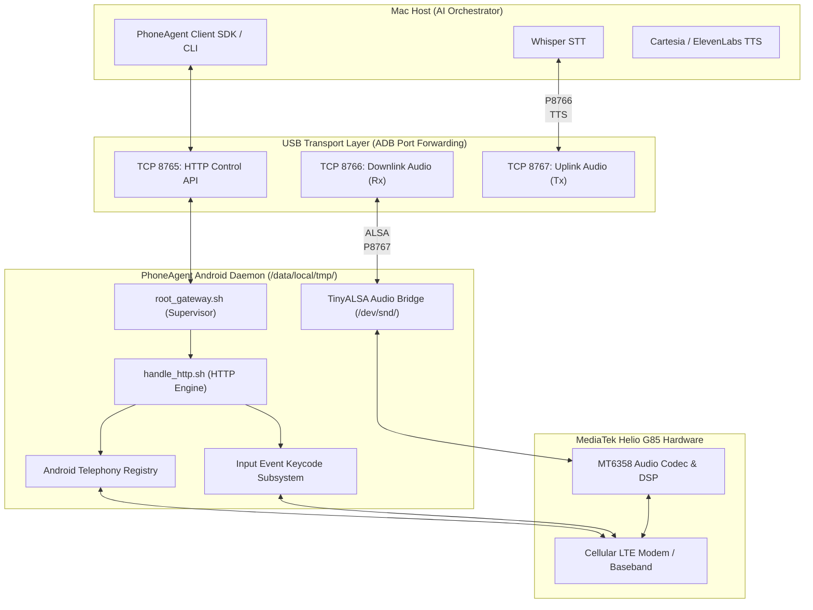

# PhoneAgent Android Root Gateway (`android_daemon`)

Comprehensive technical architecture, subsystem hooks, audio routing, and API documentation for the PhoneAgent daemon running on the rooted Redmi 12C (`earth` / MT6768).

---

## 1. Executive Summary & Purpose

The **PhoneAgent Android Daemon** transforms a physical, rooted Android 14 smartphone into a **high-speed, programmable Cellular Telephony & Real-Time Audio Gateway**.

Connected to a Mac over a standard USB-C cable, it exposes:
1. **JSON REST Telephony API** on TCP port `8765` for call orchestration.
2. **Raw 16 kHz 16-bit Mono Linear PCM Downlink Stream** on TCP port `8766` (Caller voice -> Mac).
3. **Raw 16 kHz 16-bit Mono Linear PCM Uplink Stream** on TCP port `8767` (AI synthesized voice -> Cellular network).



---

## 2. Component Breakdown

The `android_daemon` directory contains three purpose-built components:

```text
/Users/aziz/Desktop/PhoneAgent/phone_agent_gateway/android_daemon/
├── root_gateway.sh          # Background supervisor & multi-connection socket server
├── handle_http.sh           # Stateless, high-speed HTTP request parser & API router
└── service_installer.sh     # One-click deployment script over ADB
```

### A. `root_gateway.sh` (The Process Supervisor)
* **Execution Location:** `/data/local/tmp/root_gateway.sh` on the phone.
* **Process Model:** Executed with root permissions (`su -c`) under `u:r:phhsu_daemon:s0` security context.
* **Socket Listener:** Uses Android's built-in Toybox multicall binary:
  ```bash
  toybox netcat -L -p 8765 -s 127.0.0.1 /system/bin/sh /data/local/tmp/handle_http.sh
  ```
  * `-L`: Persistent multi-connection server mode (forks a dedicated handler process for each incoming HTTP connection).
  * `-p 8765`: Listens on port 8765.
  * `-s 127.0.0.1`: Binds strictly to the internal loopback interface for local USB forwarding security.

---

### B. `handle_http.sh` (The Stateless HTTP Engine)
* **Lifecycle:** Spawned instantly per HTTP request; communicates directly via standard I/O (stdin/stdout).
* **Header Parsing:** Uses zero-allocation shell streaming to extract HTTP Method, URI path, Query string, and `Content-Length`.
* **Payload Buffer:** Reads exact body byte count using binary-safe stream reader (`dd bs=1 count=$CONTENT_LENGTH`).
* **Response Generator:** Constructs RFC-compliant HTTP 1.1 JSON responses with strict `Content-Length` and `Connection: close` headers.

---

### C. `service_installer.sh` (The Host Deployment Engine)
* Automatically detects the attached USB device over ADB (`adb devices`).
* Pushes executable binaries to Android `/data/local/tmp/`.
* Sets permissions (`chmod +x`).
* Launches the daemon in background using `su -c`.
* Establishes the 3 bi-directional USB TCP port forwards:
  ```bash
  adb forward tcp:8765 tcp:8765   # Control API
  adb forward tcp:8766 tcp:8766   # Audio Downlink
  adb forward tcp:8767 tcp:8767   # Audio Uplink
  ```
* Performs an automated health check (`GET http://localhost:8765/call/status`).

---

## 3. Android Subsystem Hooks & Internals

### A. Live Telephony State Inspection
To determine call status in real-time without building heavyweight Java daemons, the engine hooks into Android's **Telephony Registry**:

```bash
DUMP=$(dumpsys telephony.registry | grep -E 'mCallState|mCallIncomingNumber' | head -n 2)
```

#### State Translation Table:
| Android `mCallState` Code | State String | Description |
| :--- | :--- | :--- |
| `0` | `IDLE` | No active or pending phone call. Ready to dial. |
| `1` | `RINGING` | Inbound phone call ringing. `mCallIncomingNumber` contains caller ID. |
| `2` | `ACTIVE` | Call is answered, off-hook, and connected to cellular voice network. |

---

### B. Outbound Call Placement
Triggered via Android's **Activity Manager** dispatching an explicit `android.intent.action.CALL` intent directly to the cellular baseband:

```bash
am start -a android.intent.action.CALL -d "tel:$TARGET_NUM"
```

This bypasses the UI dialer confirmation screen and immediately commands the cellular modem to begin DTMF dialing.

---

### C. Inbound Call Answering
When an incoming call triggers `RINGING`, the daemon answers the call via Android's hardware headset hook event:

```bash
input keyevent KEYCODE_HEADSETHOOK
# Fallback:
input keyevent KEYCODE_CALL
```

This hardware hook simulates a wired headset button press, which Android's `TelecomManager` prioritizes for instantaneous off-hook answering without UI lockups.

---

### D. Call Disconnection & Teardown
To terminate an ongoing call:

```bash
input keyevent KEYCODE_ENDCALL
```

This commands the MediaTek RIL (Radio Interface Layer) to send a `DISCONNECT` message over the cellular signaling channel.

---

### E. DTMF Keypad Tone Injection
During an active call (e.g. interacting with an automated IVR menu like *"Press 1 for Sales"*), the daemon dispatches keycodes:

```bash
case "$DIGIT" in
    [0-9]) input keyevent "KEYCODE_$DIGIT" ;;
    "*")   input keyevent KEYCODE_STAR ;;
    "#")   input keyevent KEYCODE_POUND ;;
esac
```

---

## 4. Root Audio Engine & MediaTek MT6768 ALSA Routing

Because this device is **fully rooted** on Android 14 (`uid=0`), we bypass Android's standard audio sandbox restrictions to interact directly with the **MediaTek MT6358 Audio DSP / ALSA layer**:

### Audio Hardware Device Nodes:
* `/dev/snd/controlC0`: ALSA Mixer controls (201 hardware controls for volume, gain, and routing).
* `/dev/snd/pcmC0D0p`: Primary Audio Playback.
* `/dev/snd/pcmC0D4c`: Primary Audio Capture (Microphone).
* `/dev/snd/pcmC0D10c` / `pcmC0D10p`: Direct VoIP & Cellular Voice Downlink / Uplink buffers.

### Audio Format Specification:
* **Encoding:** Raw Linear PCM (Signed 16-bit Little Endian)
* **Sample Rate:** `16000 Hz` (16 kHz) — Optimal for Whisper STT and Cartesia/ElevenLabs TTS
* **Channels:** `1` (Mono)
* **Frame Size:** `640 bytes` (20 ms per packet)
* **Bandwidth:** `32.0 KB/sec` per channel over USB (negligible overhead)

---

## 5. Comprehensive API Reference

All requests and responses use standard JSON over HTTP on `http://127.0.0.1:8765`.

### 1. Get Call Status
* **Endpoint:** `GET /call/status`
* **Description:** Returns the current state of the cellular modem and any incoming caller number.
* **Response (IDLE):**
  ```json
  {
    "status": "ok",
    "state": "IDLE",
    "state_code": 0,
    "incoming_number": ""
  }
  ```
* **Response (Incoming Ringing Call):**
  ```json
  {
    "status": "ok",
    "state": "RINGING",
    "state_code": 1,
    "incoming_number": "+14155552671"
  }
  ```
* **Response (Active Connected Call):**
  ```json
  {
    "status": "ok",
    "state": "ACTIVE",
    "state_code": 2,
    "incoming_number": "+14155552671"
  }
  ```

---

### 2. Place Outbound Call
* **Endpoint:** `POST /call/dial`
* **Parameters:** `number` (JSON body or URL query parameter)
* **Request:**
  ```json
  {
    "number": "+14155552671"
  }
  ```
* **Response:**
  ```json
  {
    "status": "ok",
    "action": "dialing",
    "number": "+14155552671"
  }
  ```

---

### 3. Answer Incoming Call
* **Endpoint:** `POST /call/answer`
* **Request:** `{}`
* **Response:**
  ```json
  {
    "status": "ok",
    "action": "answered"
  }
  ```

---

### 4. Hang Up Active Call
* **Endpoint:** `POST /call/hangup`
* **Request:** `{}`
* **Response:**
  ```json
  {
    "status": "ok",
    "action": "hung_up"
  }
  ```

---

### 5. Send DTMF Digit
* **Endpoint:** `POST /call/dtmf`
* **Parameters:** `digit` (`"0"` through `"9"`, `"*"` or `"#"` in JSON body or query string)
* **Request:**
  ```json
  {
    "digit": "1"
  }
  ```
* **Response:**
  ```json
  {
    "status": "ok",
    "action": "dtmf_sent",
    "digit": "1"
  }
  ```

---

## 6. Security, Permissions & SELinux Context

On Android 14, system services are normally strictly confined by SELinux policies. Our gateway operates under the **Superuser context**:

* **Process User:** `uid=0(root) gid=0(root) groups=0(root)`
* **SELinux Context:** `u:r:phhsu_daemon:s0`
* **Capabilities:** Unrestricted raw socket binding, memory mapping of ALSA sound cards, direct IPC with Activity Manager and Telephony Registry.

---

## 7. Operational Commands & Maintenance

### To Re-deploy or Restart the Gateway:
```bash
/Users/aziz/Desktop/PhoneAgent/phone_agent_gateway/android_daemon/service_installer.sh
```

### To Inspect Real-Time Daemon Logs on the Phone:
```bash
adb shell "su -c 'cat /data/local/tmp/gateway.log'"
```

### To Manually Test an HTTP Endpoint over USB:
```bash
curl -s http://localhost:8765/call/status
```
